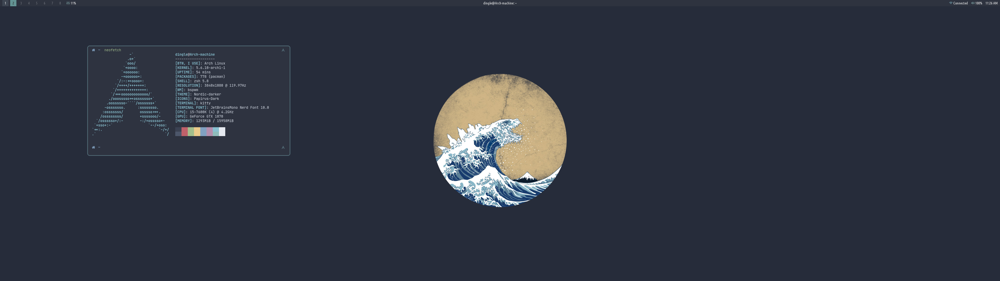

# dotfiles
The general dots for my Arch install, as well as the important configs I've included my wallpapers and my personal bin which contains some useful bits and bobs like bluetooth scripts etc.

## VIM Plugins
* Airline
* Auto-Pairs
* Emmet-vim
* Neocomplete
* NERDTree
* Syntastic
* Vim-CSS-Color
* Vim-multiple-cursors

## Bin
The bluetooth scripts found within the bin folder make use of bluetoothctl and awk and thus require both.

## Software List
* Terminal(s): Kitty, Urxvt-256bit Color
* Browser(s): Firefox, Qutebrowser
* Office: LibreOffice
* Text Editor(s): DOOM Emacs, Vim, Codium
* File Manager(s): Vifm, PCManFM
* Music Player(s): DeaDBeeF, Spotify (spicetify), MOCP (pulse)
* Media Player: VLC
* System Monitor: HTOP
* Document Viewer: Zathura
